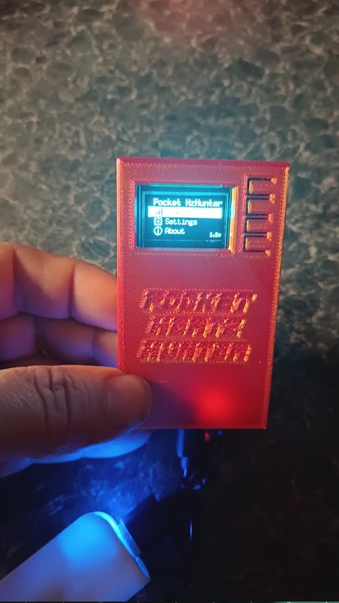
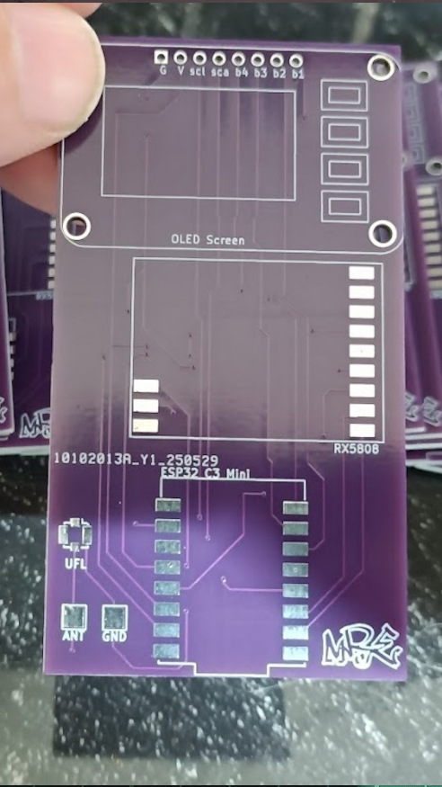
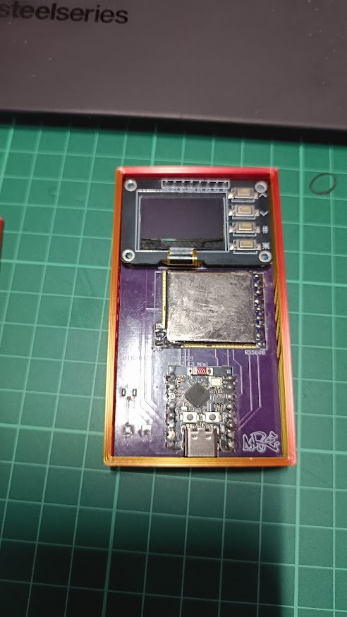
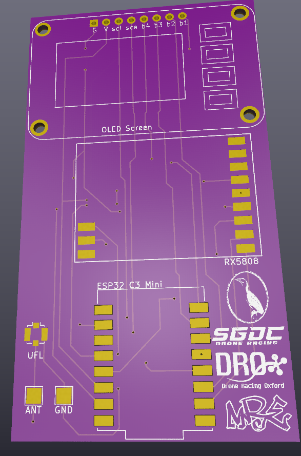
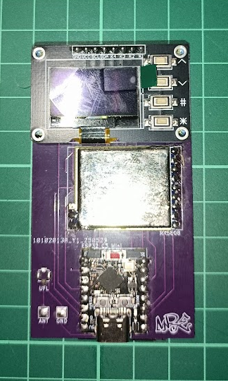

# Pocket Hertz Hunter

## Contents

1. [Introduction](#introduction)
2. [Features](#features)
3. [Hardware](#hardware)
    - [Components](#components)
    - [Construction](#Construction)
4. [Software](#software)
    - [Environmental setup](#environment-setup)
5. [Usage](#usage)
    - [Menus](#menus)
    - [Operation](#Operation)
    - [Resetting](#resetting)

## Introduction

Taking Odddollar's Hertz Hunter to an easy & very cheap compact version, that any individual or club could have in their gear.

*Images*

    
    
    

## Features

- Minimal cost
- Very easy to assemble
- One simple PCB with 3 components 
    - Gerber files available, you can pick up 15 PCBs for $10~ ( with an introductory offer )
- Runs off USB-C
- 3D printed case & files
- The same functionality as Hertz Hunter

## Hardware

### Components

The components list are easy to attach to the PCB, the screen is 8 through holes, the ESP32 and RX5808 have nice large pads to affix them.

- 1x [ESP32-C3 Super Mini](https://www.aliexpress.com/w/wholesale-esp32-c3-super-mini.html) (<$5)
- 1x [RX5808 with SPI mod](https://www.aliexpress.com/w/wholesale-rx5808-spi.html) (\$25 to \$50 depending on the seller)
- 1x [0.96" I2C 128x64 OLED 4 Key](https://www.aliexpress.com/w/wholesale-OLED-Display-with-4x4-key-I2C-SSD1315.html) (<$5)
    - the SSD1315 seems to work well using the SSD1306 / u8g1 library.
- 1x 5.8GHz antenna
    - The PCB has pads for a U.FL for an SMA pigtail or it has pads to direct solder a whip onto.

### Construction

    
    

## Software
For Enviroment & Software installation, please follow the orignal instructions:
[You can find them here](https://github.com/odddollar/Hertz-hunter?tab=readme-ov-file#software). 

## Usage

### Menus

There are three buttons used to operate the device:

- `NEXT` - Go to the next item
- `PREV` - Go to the previous item
- `SEL` - Select an item
    - Press and hold `SEL` to go back

The menu items can be navigated between with `PREV` and `NEXT`, and once the desired menu item is highlighted, `SEL` can be used to select it. `SEL` can also be held to exit each menu.

### Operation

All other device information about configuration, calibration and usage [ can be found here ](https://github.com/odddollar/Hertz-hunter?tab=readme-ov-file#usage)

### Resetting

Due to the fact that the settings and calibration values are stored in non-volatile memory, flashing the firmware again won't wipe them. If, for some reason, the device needs to be completely reset, press `PREV`, `SEL` and `NEXT` simultaneously. The device should reboot with everything completely wiped and reset.

